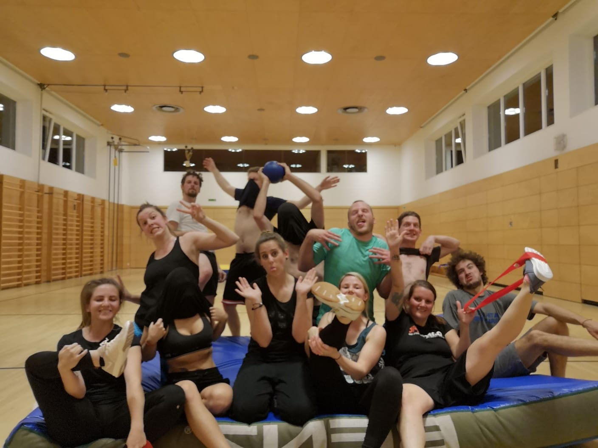

# Ballspielclub Frastanz

temporäre Webseite des BSCF 

Wir sind ein Verein aus Frastanz und spielen einmal die Woche klassische Spiele wie man sie aus dem Sportunterreicht der Schulen kennt.  
Entstanden ist der Verein durch einige Freunde die einfach Lust hatten Völkerball zu spielen. 
Völkerball, Merkball, Brennball aber auch moderne Spiele werden bei uns gespielt. Wir probieren immer wieder mal neue Spiele durch. Wenns gefällt, wirds gespielt.

### Kontakt
[Email](mailto:bscf@gmx.at) 
[Instagram](https://www.instagram.com/ballspielclubfrastanz/)

### Training

Mittwoch 20 bis 22 Uhr

Turnhalle Volksschule 
Schmittengasse 4 
6820 Frastanz, AT 

<iframe src="https://www.google.com/maps/embed?pb=!1m18!1m12!1m3!1d2709.922439722304!2d9.628910615617068!3d47.21809987916083!2m3!1f0!2f0!3f0!3m2!1i1024!2i768!4f13.1!3m3!1m2!1s0x479b3837abdb3bd9%3A0x48bf161fbf5e5772!2sAdalbert-Welte-Saal!5e0!3m2!1sde!2sat!4v1558645557504!5m2!1sde!2sat" width="600" height="450" frameborder="0" style="border:0" allowfullscreen></iframe>

### Bankverbindung
IBAN: AT95 2060 4031 0238 7341

